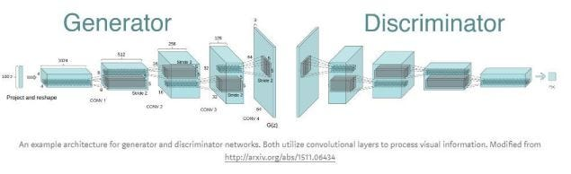

# Title
DCGAN Implementation on CelebFaces Dataset for Generating Face Images

## Description
This project explores Generative AI at a beginner level, utilizing a DCGAN model adapted from Goodfellow's paper and other resources. The CelebFaces Dataset from Kaggle is used for training.

## Table of Contents
- [Description](#description)
- [Generative Adversarial Networks (GANs)](#generative-adversarial-networks-gans)
- [Training Pseudocode](#training-pseudocode)
- [Installation](#installation)
- [Usage](#usage)
- [Contributing](#contributing)
- [License](#license)
- [Credits](#credits)

## Generative Adversarial Networks (GANs)
A GAN consists of three key components: Discriminator, Generator, and latent space. These components engage in a competitive process where the generator aims to produce realistic images to fool the discriminator, while the discriminator aims to distinguish between real and fake images. Binary cross-entropy loss is used for training the discriminator and the generator, creating a minimax game scenario.

## Training Pseudocode
### 1. Initialize Training Parameters
   - Set number of epochs (e.g., 100)
   - Set batch size (e.g., 128)

### 2. Start Training Loop
   - For each epoch in the range of total epochs:
      - For each batch in the data loader:
         - Reset gradients of the discriminator
         - Print status update if batch index is a multiple of 100
         - Get samples from real data
         - Assign real labels as 1
         - Train the discriminator on real data:
            - Forward pass real images through discriminator
            - Calculate loss for real images
            - Backpropagate and update discriminator parameters
         - Generate fake data:
            - Generate random noise vectors (latent space)
            - Generate fake images from noise using the generator
         - Assign fake labels as 0
         - Train the discriminator on fake data:
            - Forward pass fake images through discriminator
            - Calculate loss for fake images
            - Backpropagate and update discriminator parameters
         - Train the generator:
            - Reset gradients of the generator
            - Assign real labels (as 1) for fake images
            - Forward pass fake images through discriminator
            - Calculate loss for generator
            - Backpropagate and update generator parameters

### 3. Save Model
   - Save generator and discriminator models' state dictionaries to files (e.g., 'DCGAN_celeba_g.pth' and 'DCGAN_celeba_d.pth')

## Installation
1. Clone the repository.
2. Install dependencies from `requirements.txt` using pip:

## Usage
1. Set up the environment and install dependencies.
2. Run the training script to train the DCGAN model.
3. Optionally, adjust hyperparameters and configurations as needed.

## Contributing
Contributions are welcome! Please reach me out for any possible contributions.

## Further Info
The model has been trained many epochs beforehand to be able to hold the weights inside of the DCGAN_celeba_d and DCGAN_celeba_g files. In the latest version, a transfer learning method has been used. The initial weights have been assigned from the weights that has been obtained from the previous trainings.

## License
This project is licensed under the [MIT License](LICENSE).

## Credits
- [Goodfellow's GAN Paper](https://arxiv.org/abs/1701.00160v4)
- [CelebFaces Dataset on Kaggle](https://www.kaggle.com/datasets/jessicali9530/celeba-dataset)
- [DataHacker's DCGAN Tutorial](https://datahacker.rs/014-developing-a-dcgan-for-celeba-dataset/)
- [My Common Deep Learning Architectures](https://github.com/kutayturkoglu/common-deep-learning-architectures)
- [I2DL Lecture by TUM](https://niessner.github.io/I2DL/)
